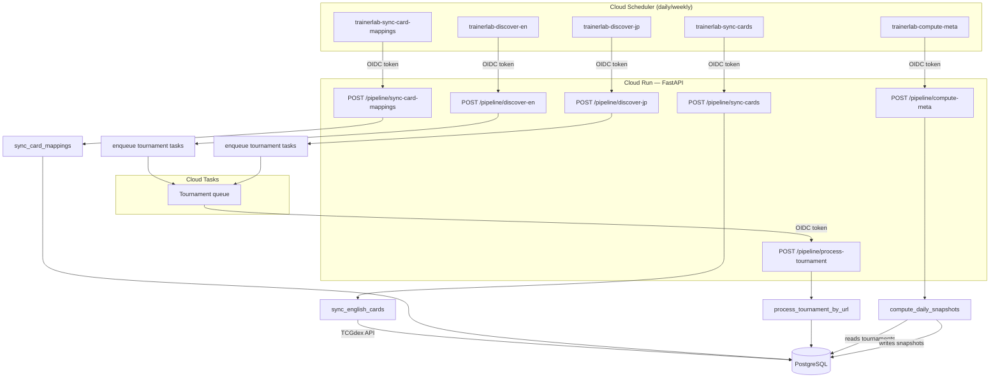
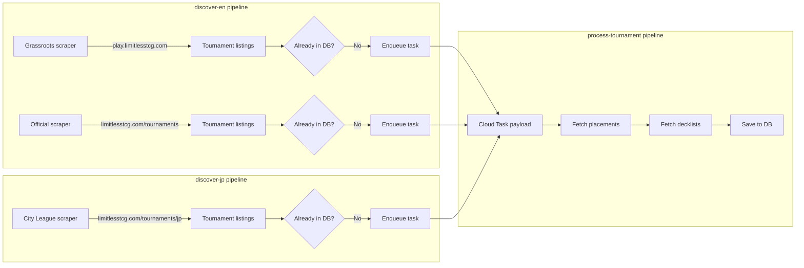
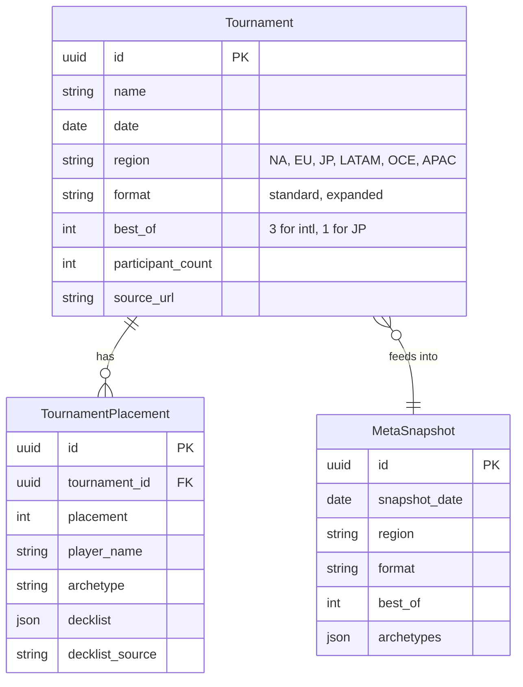

# Scraper Architecture

How tournament data flows from Limitless into TrainerLab.

## Data Sources

There are **two separate Limitless websites** with different data:

| Source          | URL                                                     | What it has                          | Used by       |
| --------------- | ------------------------------------------------------- | ------------------------------------ | ------------- |
| **Official DB** | `limitlesstcg.com/tournaments`                          | Regionals, ICs, Worlds (all regions) | `discover-en` |
| **Official JP** | `limitlesstcg.com/tournaments/jp`                       | Japanese City Leagues (BO1)          | `discover-jp` |
| **Grassroots**  | `play.limitlesstcg.com/tournaments/completed?game=PTCG` | Community-run online events          | `discover-en` |

> **Weighting note:** Official tournament data should carry heavier weight for
> evaluating the competitive format. Grassroots data is useful for tracking how
> community meta trends influence major tournament metagame share.

## Pipeline Overview



## Discovery + Processing Detail



## Key Files

```
apps/api/src/
  routers/pipeline.py              # POST endpoints (entry points)
  pipelines/
    scrape_limitless.py            # Discovery + processing orchestration (EN + JP)
    compute_meta.py                # Meta snapshot computation
    sync_cards.py                  # TCGdex card sync
    sync_card_mappings.py          # JP↔EN card ID mapping sync
  services/
    cloud_tasks.py                 # Cloud Tasks enqueue logic
    tournament_scrape.py           # Scrape + save logic (TournamentScrapeService)
  clients/
    limitless.py                   # HTTP client for both Limitless sites
  models/
    tournament.py                  # Tournament + TournamentPlacement models
    card_id_mapping.py             # JP↔EN card ID mapping table
```

## Call Chain

### discover-en

```
POST /pipeline/discover-en
  -> discover_en_tournaments()                         # scrape_limitless.py
    -> TournamentScrapeService.discover_new_tournaments(region="en")
      -> LimitlessClient.fetch_tournament_listings()    # play.limitlesstcg.com
    -> TournamentScrapeService.discover_official_tournaments()
      -> LimitlessClient.fetch_official_tournament_listings() # limitlesstcg.com
    -> CloudTasksService.enqueue_tournament()
```

### discover-jp

```
POST /pipeline/discover-jp
  -> discover_jp_tournaments()                         # scrape_limitless.py
    -> TournamentScrapeService.discover_jp_city_leagues()
      -> LimitlessClient.fetch_jp_city_league_listings()      # limitlesstcg.com/tournaments/jp
    -> CloudTasksService.enqueue_tournament()
```

### process-tournament (Cloud Tasks)

```
POST /pipeline/process-tournament
  -> process_single_tournament()                        # scrape_limitless.py
    -> TournamentScrapeService.process_tournament_by_url()
      -> LimitlessClient.fetch_*_placements()
      -> LimitlessClient.fetch_decklist()
      -> save_tournament()
```

## Data Model



## Region Handling

| Region             | Source                      | best_of | Page                                     |
| ------------------ | --------------------------- | ------- | ---------------------------------------- |
| NA, EU, LATAM, OCE | Official + Grassroots       | 3       | `/tournaments` + `play.limitlesstcg.com` |
| JP                 | City Leagues                | 1       | `/tournaments/jp`                        |
| APAC               | Official (KR, TW, SG, etc.) | 3       | `/tournaments`                           |

The EN pipeline's official scraper maps country codes to regions via `_country_to_region()`.
JP tournaments are always BO1 (ties = double loss).

## Tool Radar

Tools evaluated for potential adoption. Not currently in use.

| Tool                               | What It Does                                                                                                                                                                                            | When to Revisit                                                                         | Evaluated  |
| ---------------------------------- | ------------------------------------------------------------------------------------------------------------------------------------------------------------------------------------------------------- | --------------------------------------------------------------------------------------- | ---------- |
| [Kernel.sh](https://www.kernel.sh) | Browsers-as-a-Service (cloud headless browsers via CDP). Headless at $0.06/hr, free tier includes $5/mo credits and 5 concurrent sessions. Supports Playwright/Puppeteer, residential proxies included. | If target sites add JS rendering, Cloudflare/bot protection, or we need to scrape SPAs. | 2026-02-22 |
