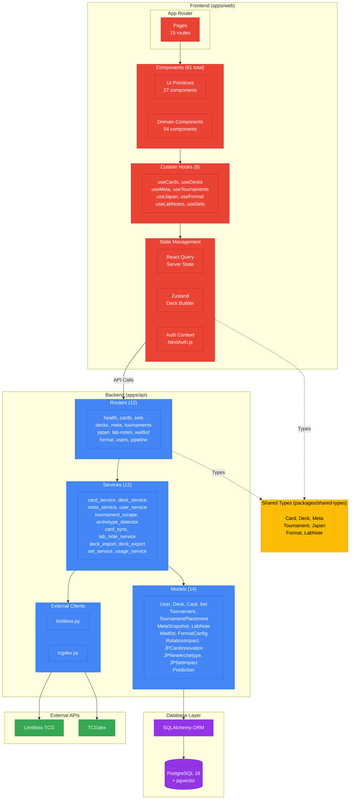

# Application Layers

> Internal architecture showing clean separation of concerns across frontend and backend.

## Overview

TrainerLab follows a layered architecture pattern with clear boundaries between presentation, business logic, and data access. The frontend uses React with modern state management, while the backend follows a service-oriented architecture with dedicated layers for routing, business logic, and data persistence.

## Diagram

## Key Components

| Layer          | Count | Description                          |
| -------------- | ----- | ------------------------------------ |
| **Pages**      | 15    | Next.js App Router page components   |
| **Components** | 81    | React components (27 UI + 54 domain) |
| **Hooks**      | 8     | Custom React hooks for data fetching |
| **Routers**    | 12    | FastAPI endpoint groups              |
| **Services**   | 12    | Business logic implementations       |
| **Models**     | 14    | SQLAlchemy ORM models                |
| **Clients**    | 2     | External API integrations            |

## Frontend Component Breakdown

| Domain      | Components | Purpose                       |
| ----------- | ---------- | ----------------------------- |
| ui          | 27         | shadcn/ui + custom primitives |
| meta        | 16         | Meta dashboard visualizations |
| deck        | 9          | Deck builder interface        |
| home        | 9          | Landing page sections         |
| cards       | 7          | Card search and display       |
| layout      | 7          | Navigation and structure      |
| japan       | 4          | JP-specific intelligence      |
| rotation    | 4          | Format rotation tracking      |
| auth        | 2          | Login/register forms          |
| tournaments | 2          | Tournament browsing           |
| lab-notes   | 2          | Content articles              |
| commerce    | 1          | Affiliate CTAs                |

## Notes

- Frontend uses React Query for server state caching and Zustand for local UI state
- Backend follows dependency injection pattern via FastAPI's `Depends()`
- Shared types package ensures type consistency between frontend and backend
- All database access goes through SQLAlchemy ORM with async support
- External clients are isolated to allow easy mocking in tests
