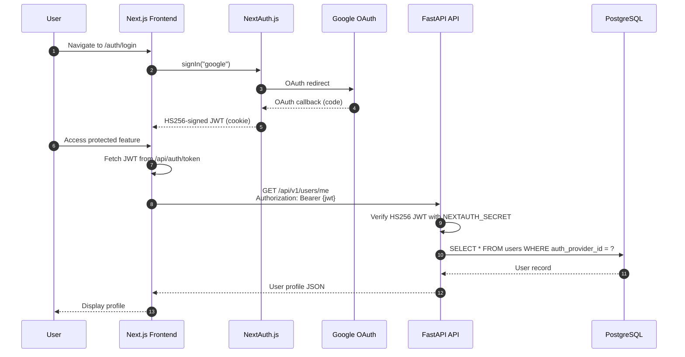
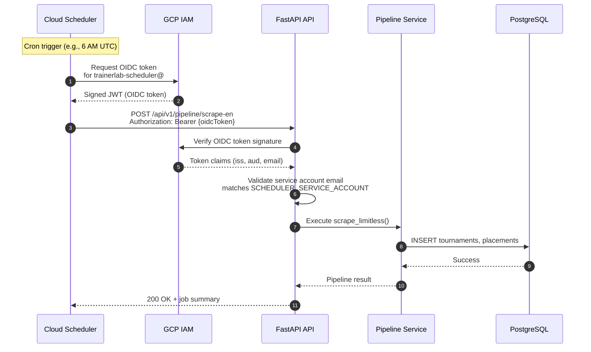

# Authentication

> End-to-end authentication flows for users and automated services.

## Overview

TrainerLab implements two distinct authentication flows: NextAuth.js (Auth.js v5) with Google OAuth for end users and OIDC token verification for Cloud Scheduler pipeline jobs. Both flows validate tokens server-side before granting access to protected resources.

## User Authentication Flow



## Service Authentication Flow (Cloud Scheduler)



## Key Components

| Component             | Description                                             |
| --------------------- | ------------------------------------------------------- |
| **NextAuth.js**       | Auth.js v5 with Google OAuth provider, custom HS256 JWT |
| **useAuth hook**      | React hook wrapping `useSession()` for auth state       |
| **SessionProvider**   | NextAuth React context provider in `providers.tsx`      |
| **jwt.py**            | Backend HS256 JWT verification using `python-jose`      |
| **OIDC Token**        | Service-to-service authentication for Cloud Scheduler   |
| **scheduler_auth.py** | FastAPI dependency for validating scheduler requests    |

## Authentication Dependencies

```python
# User authentication (dependencies/auth.py)
async def get_current_user(
    db: AsyncSession = Depends(get_db),
    authorization: str | None = Header(default=None),
) -> User:
    # Verify HS256 JWT using NEXTAUTH_SECRET
    # Look up user by auth_provider_id (Google providerAccountId)
    # Auto-create user on first login
    # Return User model

# Scheduler authentication (dependencies/scheduler_auth.py)
async def verify_scheduler_token(
    request: Request,
    settings: Settings = Depends(get_settings)
) -> bool:
    # Verify OIDC token signature
    # Check email matches scheduler SA
    # Return True or raise 401
```

## Protected Endpoints

| Endpoint             | Auth Type | Description             |
| -------------------- | --------- | ----------------------- |
| `/api/v1/users/me`   | User      | Current user profile    |
| `/api/v1/decks/*`    | User      | Deck CRUD operations    |
| `/api/v1/pipeline/*` | Scheduler | Data pipeline execution |

## Token Verification

### User JWTs (NextAuth.js)

- Signed with: HS256 using shared `NEXTAUTH_SECRET`
- Verified using: `python-jose` on the backend
- Key claims: `sub` (Google providerAccountId), `email`, `name`, `picture`
- Expiry: 30 days
- Storage: HTTP-only cookie managed by NextAuth.js

### Service OIDC Tokens (Cloud Scheduler)

- Issued by: `https://accounts.google.com`
- Verified using: Google's public keys
- Contains: `iss`, `aud`, `email`, `exp`
- Audience: Cloud Run service URL
- Expiry: 1 hour

## Environment Variables

### Frontend (`apps/web/.env.local`)

- `NEXTAUTH_SECRET` — shared secret for JWT signing (must match backend)
- `NEXTAUTH_URL` — canonical URL (auto-set on Vercel)
- `GOOGLE_CLIENT_ID` — Google OAuth client ID
- `GOOGLE_CLIENT_SECRET` — Google OAuth client secret

### Backend (`apps/api/.env`)

- `NEXTAUTH_SECRET` — shared secret for JWT verification (must match frontend)

## Notes

- Frontend auth state managed via `SessionProvider` + `useSession()` from next-auth/react
- JWT is an HS256-signed token (not encrypted JWE) so the Python backend can verify it trivially
- `auth_provider_id` in the users table stores Google's `providerAccountId`
- Scheduler OIDC tokens are generated fresh for each job execution
- Operations service account can also invoke pipelines for manual testing
- All authentication failures return 401 Unauthorized with minimal error details
