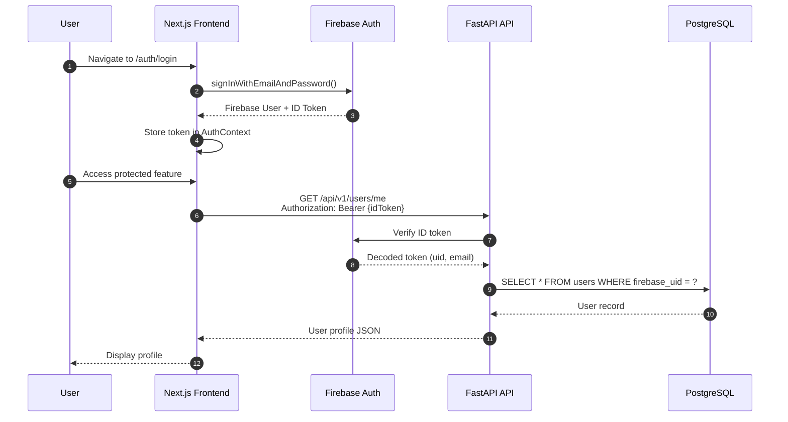
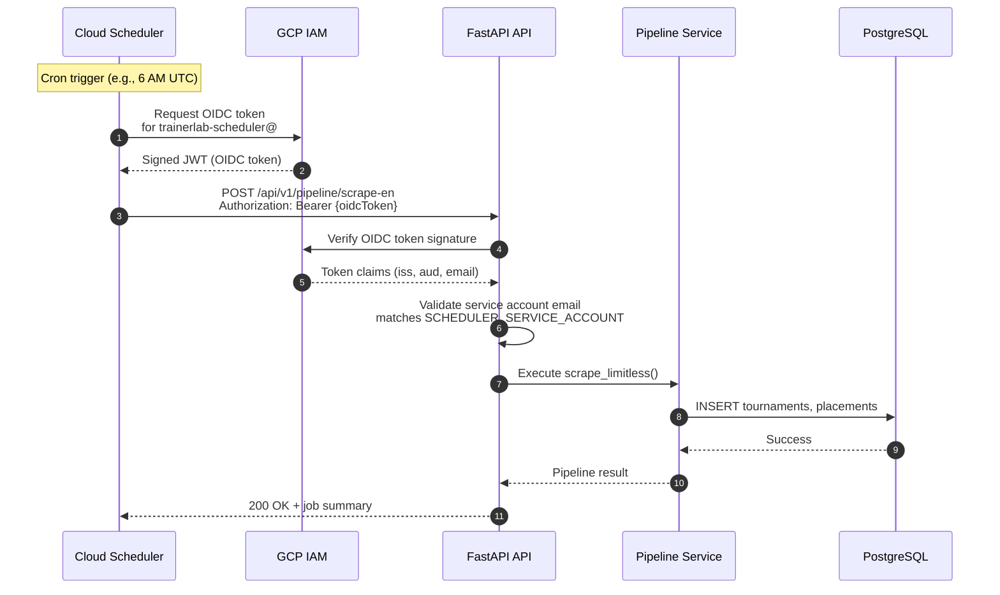

# Authentication

> End-to-end authentication flows for users and automated services.

## Overview

TrainerLab implements two distinct authentication flows: Firebase Authentication for end users and OIDC token verification for Cloud Scheduler pipeline jobs. Both flows validate tokens server-side before granting access to protected resources.

## User Authentication Flow



## Service Authentication Flow (Cloud Scheduler)



## Key Components

| Component              | Description                                           |
| ---------------------- | ----------------------------------------------------- |
| **Firebase Auth SDK**  | Client-side authentication in Next.js                 |
| **AuthContext**        | React context managing auth state and token           |
| **Firebase Admin SDK** | Server-side token verification in FastAPI             |
| **OIDC Token**         | Service-to-service authentication for Cloud Scheduler |
| **scheduler_auth.py**  | FastAPI dependency for validating scheduler requests  |

## Authentication Dependencies

```python
# User authentication (dependencies/auth.py)
async def get_current_user(
    token: str = Depends(oauth2_scheme),
    db: AsyncSession = Depends(get_db)
) -> User:
    # Verify Firebase ID token
    # Look up user by firebase_uid
    # Return User model

# Scheduler authentication (dependencies/scheduler_auth.py)
async def verify_scheduler_token(
    request: Request,
    settings: Settings = Depends(get_settings)
) -> bool:
    # Verify OIDC token signature
    # Check email matches scheduler SA
    # Return True or raise 401
```

## Protected Endpoints

| Endpoint             | Auth Type | Description             |
| -------------------- | --------- | ----------------------- |
| `/api/v1/users/me`   | User      | Current user profile    |
| `/api/v1/decks/*`    | User      | Deck CRUD operations    |
| `/api/v1/pipeline/*` | Scheduler | Data pipeline execution |

## Token Verification

### User ID Tokens (Firebase)

- Issued by: `https://securetoken.google.com/{project_id}`
- Verified using: Firebase Admin SDK
- Contains: `uid`, `email`, `email_verified`
- Expiry: 1 hour (auto-refreshed by client SDK)

### Service OIDC Tokens (Cloud Scheduler)

- Issued by: `https://accounts.google.com`
- Verified using: Google's public keys
- Contains: `iss`, `aud`, `email`, `exp`
- Audience: Cloud Run service URL
- Expiry: 1 hour

## Notes

- Frontend stores Firebase auth state in React Context, not localStorage
- ID tokens are automatically refreshed by Firebase SDK before expiry
- Scheduler OIDC tokens are generated fresh for each job execution
- Operations service account can also invoke pipelines for manual testing
- All authentication failures return 401 Unauthorized with minimal error details
