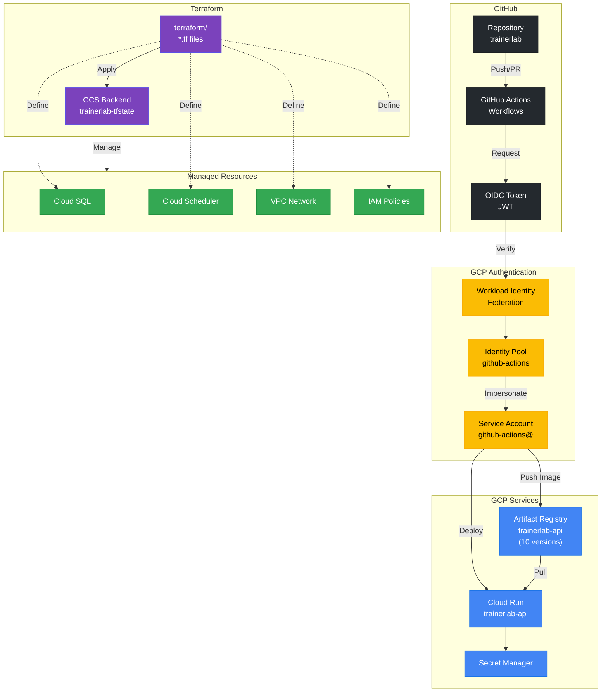

# CI/CD & Deployment

> DevOps pipeline and infrastructure management for TrainerLab.

## Overview

TrainerLab uses GitHub Actions for continuous integration and deployment, with keyless authentication to Google Cloud via Workload Identity Federation. Infrastructure is managed declaratively using Terraform with state stored in Google Cloud Storage.

## Diagram



## Key Components

| Component                        | Description                                          |
| -------------------------------- | ---------------------------------------------------- |
| **GitHub Actions**               | CI/CD workflows for testing, building, and deploying |
| **Workload Identity Federation** | Keyless authentication from GitHub to GCP            |
| **Artifact Registry**            | Docker image storage with 10-version retention       |
| **Cloud Run**                    | Serverless container deployment                      |
| **Terraform**                    | Infrastructure as code for all GCP resources         |
| **GCS State Backend**            | Remote state storage for Terraform                   |

## Deployment Pipeline

```
1. Developer pushes to main branch
2. GitHub Actions workflow triggers
3. Tests run (Python + TypeScript)
4. Docker image built and tagged
5. OIDC token exchanged for GCP credentials
6. Image pushed to Artifact Registry
7. Cloud Run service updated
8. Health check confirms deployment
```

## Terraform Structure

| File                 | Purpose                                        |
| -------------------- | ---------------------------------------------- |
| `main.tf`            | Root module, providers, resource orchestration |
| `variables.tf`       | Input variables with defaults                  |
| `outputs.tf`         | Exported values for reference                  |
| `github_oidc.tf`     | Workload Identity Federation setup             |
| `modules/cloud_run/` | Cloud Run service configuration                |
| `modules/cloud_sql/` | PostgreSQL instance setup                      |
| `modules/scheduler/` | Pipeline job definitions                       |

## Service Accounts

| Account                 | Purpose                                 |
| ----------------------- | --------------------------------------- |
| `github-actions@`       | CI/CD deployments via Workload Identity |
| `trainerlab-api@`       | Cloud Run runtime identity              |
| `trainerlab-scheduler@` | Cloud Scheduler job execution           |
| `trainerlab-ops@`       | Manual operations and testing           |

## Notes

- Workload Identity Federation eliminates the need for long-lived service account keys
- Artifact Registry cleanup policy keeps the 10 most recent images
- Terraform state is stored in GCS with prefix-based separation by environment
- Cloud Run deployments are zero-downtime with automatic rollback on failure
- GitHub repo attribute condition restricts which repositories can authenticate
