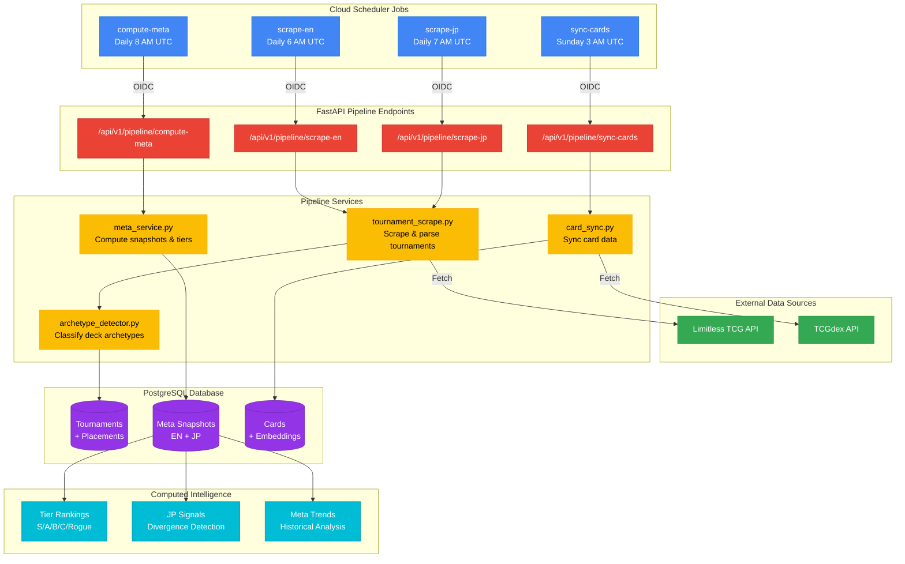

# Data Pipeline

> Automated data ingestion and processing system that powers TrainerLab's competitive intelligence.

## Overview

TrainerLab uses Cloud Scheduler to orchestrate four automated pipelines that continuously gather tournament data, synchronize card information, and compute meta snapshots. The pipelines run sequentially each day, with card sync occurring weekly during low-traffic hours.

## Diagram

## Key Components

| Component              | Description                                                               |
| ---------------------- | ------------------------------------------------------------------------- |
| **scrape-en**          | Scrapes English/international tournaments from Limitless (7-day lookback) |
| **scrape-jp**          | Scrapes Japanese tournaments with BO1 context (7-day lookback)            |
| **compute-meta**       | Calculates meta shares, tier assignments, JP signals (90-day window)      |
| **sync-cards**         | Synchronizes card data and generates embeddings from TCGdex               |
| **archetype_detector** | Identifies deck archetypes using signature card patterns                  |
| **Meta Snapshots**     | Daily aggregated meta share data, separated by region                     |

## Pipeline Schedule

| Job          | Schedule    | Timezone | Purpose                       |
| ------------ | ----------- | -------- | ----------------------------- |
| scrape-en    | `0 6 * * *` | UTC      | After EN tournaments complete |
| scrape-jp    | `0 7 * * *` | UTC      | After JP tournaments complete |
| compute-meta | `0 8 * * *` | UTC      | After all scraping finishes   |
| sync-cards   | `0 3 * * 0` | UTC      | Weekly during low traffic     |

## Notes

- Jobs execute sequentially to ensure data dependencies are met
- Each job has retry logic: 3 attempts with exponential backoff (30s-300s)
- JP data processing accounts for BO1 format (ties count as double losses)
- Archetype detection uses a curated signature card mapping maintained in `data/`
- All pipeline endpoints require OIDC authentication from the scheduler service account
