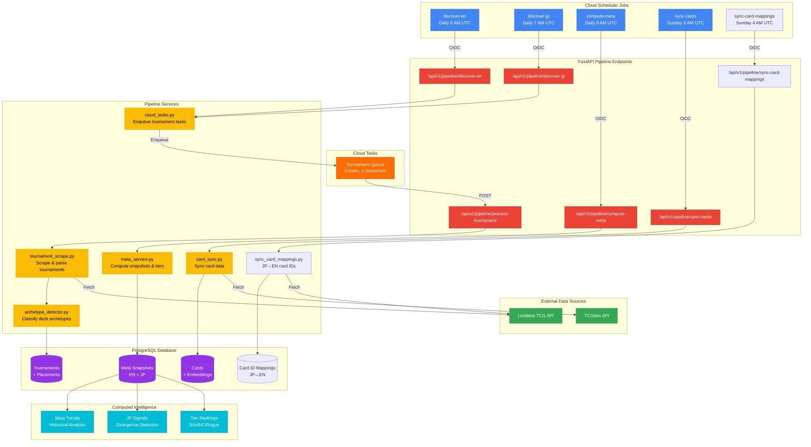

# Data Pipeline

> Automated data ingestion and processing system that powers TrainerLab's competitive intelligence.

## Overview

TrainerLab uses a two-phase pipeline architecture. Cloud Scheduler triggers discovery jobs that identify new tournaments, then Cloud Tasks queues individual tournament processing at a controlled rate. Card sync and meta computation run on their own schedules.

## Diagram

## Key Components

| Component              | Description                                                                        |
| ---------------------- | ---------------------------------------------------------------------------------- |
| **discover-en**        | Discovers new English/international tournaments from Limitless (7-day lookback)    |
| **discover-jp**        | Discovers new Japanese tournaments with BO1 context (7-day lookback)               |
| **Cloud Tasks**        | Queues individual tournaments for processing (rate-limited 0.5/sec, 2 concurrent)  |
| **process-tournament** | Processes a single tournament: scrapes placements, detects archetypes, stores data |
| **compute-meta**       | Calculates meta shares, tier assignments, JP signals (90-day window)               |
| **sync-cards**         | Synchronizes card data and generates embeddings from TCGdex                        |
| **archetype_detector** | Identifies deck archetypes using signature card patterns                           |
| **Meta Snapshots**     | Daily aggregated meta share data, separated by region                              |

## Pipeline Schedule

| Job                | Schedule    | Timezone | Purpose                       |
| ------------------ | ----------- | -------- | ----------------------------- |
| discover-en        | `0 6 * * *` | UTC      | Discover new EN tournaments   |
| discover-jp        | `0 7 * * *` | UTC      | Discover new JP tournaments   |
| compute-meta       | `0 8 * * *` | UTC      | After all processing finishes |
| sync-cards         | `0 3 * * 0` | UTC      | Weekly during low traffic     |
| sync-card-mappings | `0 4 * * 0` | UTC      | JP↔EN card ID mapping sync    |

## Notes

- Two-phase architecture: discovery jobs find new tournaments, Cloud Tasks queues individual processing
- Cloud Tasks rate-limits processing at 0.5 requests/sec with 2 concurrent dispatches to avoid overwhelming Limitless
- Each job has retry logic: 3 attempts with exponential backoff (30s-300s)
- JP data processing accounts for BO1 format (ties count as double losses)
- Archetype detection uses a curated signature card mapping maintained in `data/`
- All pipeline endpoints require OIDC authentication from the scheduler service account or Cloud Tasks
