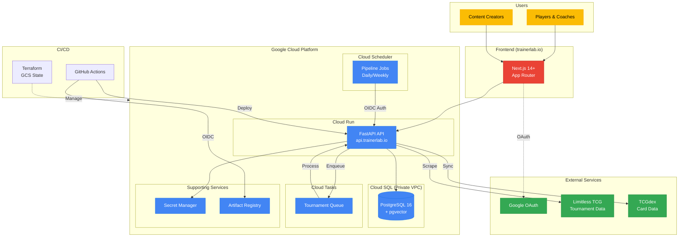

# System Overview

> Executive-level view of TrainerLab's cloud infrastructure and external integrations.

## Overview

TrainerLab is a competitive intelligence platform for Pokemon TCG, built on Google Cloud Platform. The system consists of a Next.js frontend, FastAPI backend, PostgreSQL database with vector search capabilities, and automated data pipelines that continuously gather tournament intelligence.

## Diagram

## Key Components

| Component                 | Description                                                     |
| ------------------------- | --------------------------------------------------------------- |
| **Next.js Frontend**      | React-based web application with App Router, deployed to Vercel |
| **FastAPI API**           | Python backend handling business logic, deployed to Cloud Run   |
| **PostgreSQL + pgvector** | Database with vector similarity search for card embeddings      |
| **Cloud Scheduler**       | Automated pipeline execution on defined schedules               |
| **Cloud Tasks**           | Tournament processing queue with rate limiting (0.5/sec)        |
| **Google OAuth**          | User authentication via NextAuth.js with HS256 JWT              |
| **Artifact Registry**     | Docker image storage with 10-version retention policy           |
| **Secret Manager**        | Secure storage for database credentials and API keys            |
| **Terraform**             | Infrastructure as code with GCS state backend                   |

## Notes

- Cloud SQL is accessible only via private VPC connection from Cloud Run
- All Cloud Run services use HTTPS with managed certificates
- GitHub Actions authenticates to GCP via Workload Identity Federation (keyless)
- Scheduled jobs use OIDC tokens for authenticated API calls
- Cloud Tasks rate-limits tournament processing at 0.5 requests/sec with 2 concurrent dispatches
